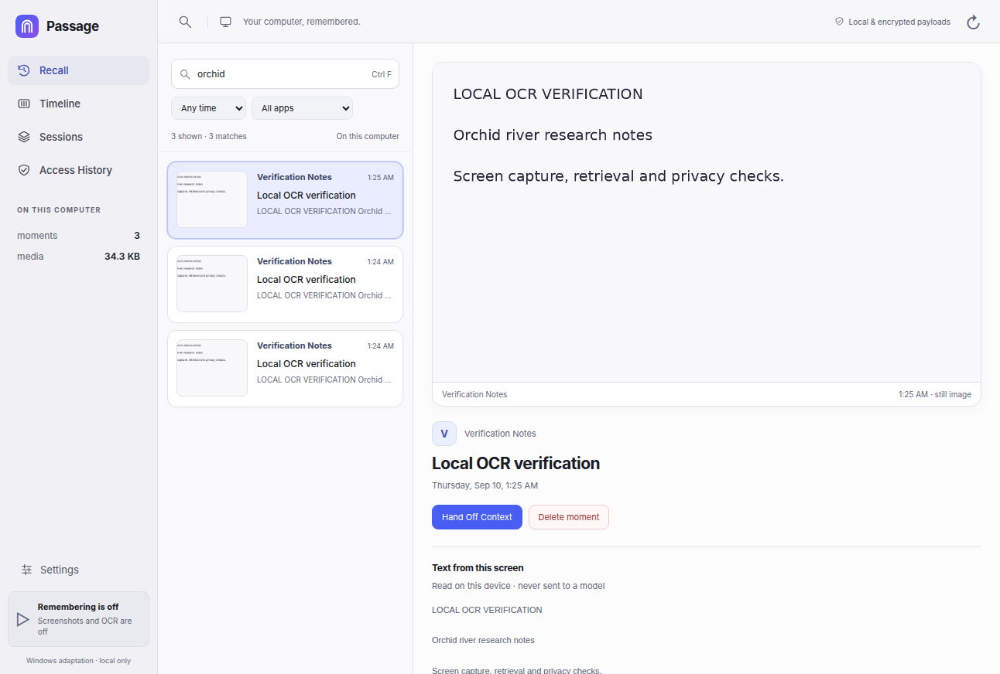
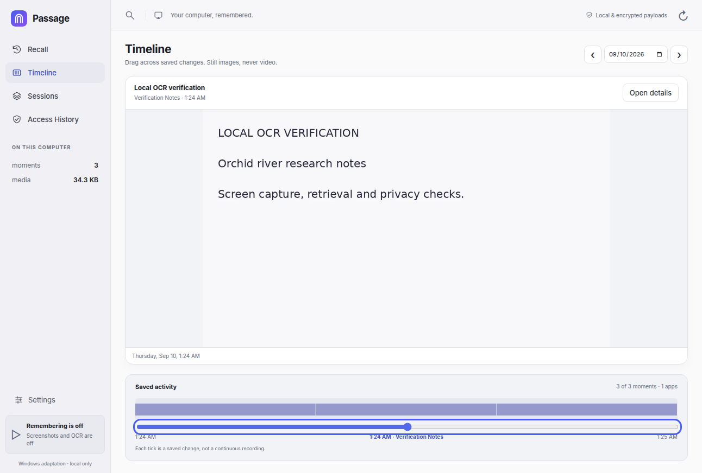
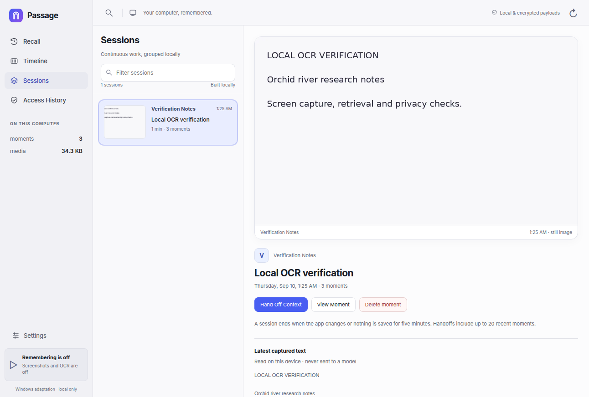
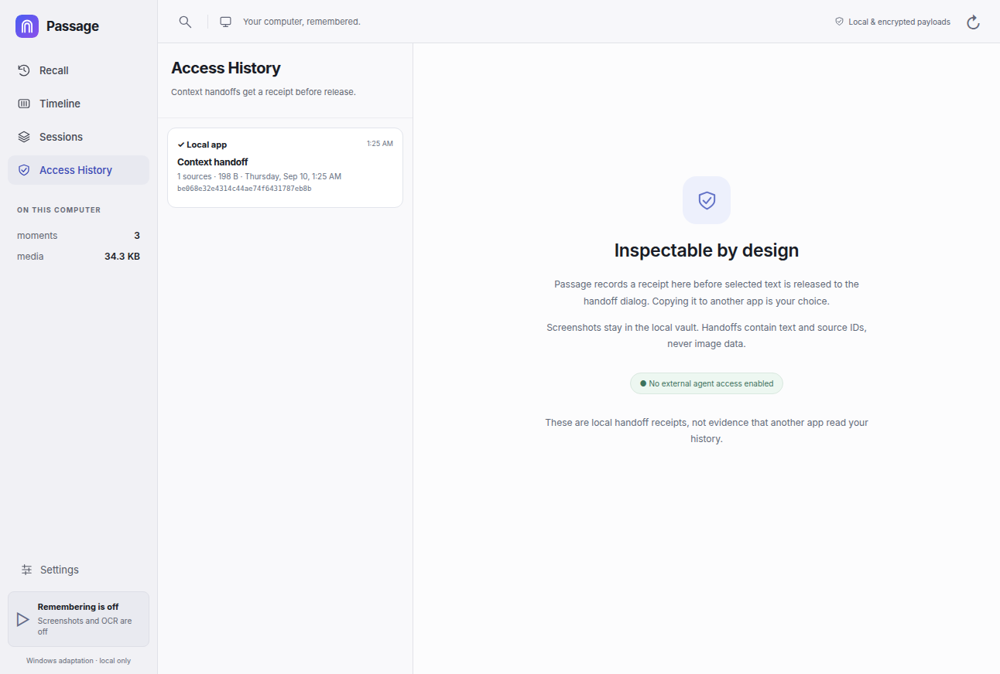
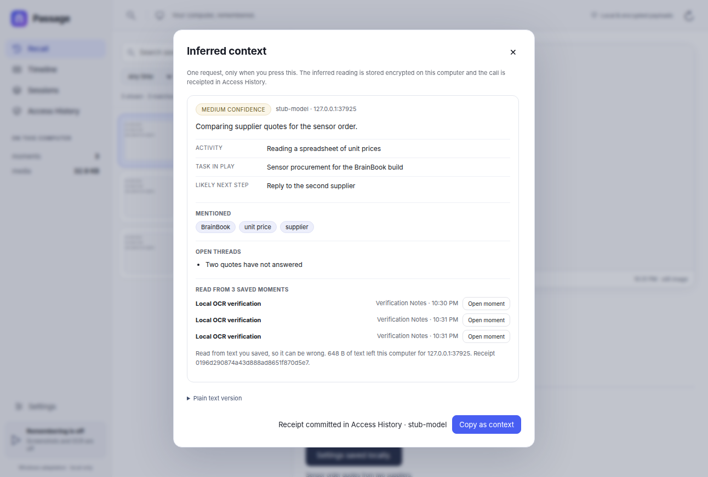

# Passage for Windows

A Windows adaptation of [Sid's Passage](https://github.com/srk97/passage): save
changed windows, search their text, and return to the screenshot that explains
what you were doing. This repository also retains its earlier activity recorder
and your existing window-title history.

The interface follows the [actual reference screenshots](https://x.com/sid_srk/status/2090171817797263765),
not a generic usage dashboard. This is an independent Python implementation,
not the upstream macOS binary or a claim of complete feature parity.

## Windows install

1. Install Python 3.10 or newer with the Python launcher enabled.
2. Extract this repository and run `install.cmd`.
3. Open **Passage** on your desktop. The older **Computer Activity Tracker**
   shortcut opens the same app.
4. Open **Settings** and enable screenshots and OCR when you are ready.

Screenshot capture is **off by default**. Installation does not enable autostart.
Launching the app starts the existing window-title recorder; screenshot capture
requires its separate setting. Only monitor a computer you own or have permission
to monitor. Windows 10/11 needs an installed OCR language in Windows Settings.
The native capture path has been exercised on Windows with Python 3.11.

Chrome or Edge opens the app in its own window without browser tabs or an address
bar. Other browsers use a normal tab. Launching the shortcut again reuses the
recorder rather than starting a second writer.

## The four views

- **Recall:** search OCR text, titles and apps; filter dates and apps; inspect the
  saved screenshot and extracted text. Search is local, lexical full-text search,
  not an external AI answer or an embedding model.
- **Timeline:** move through real saved frames with the time scrubber, arrow keys
  or previous/next controls. Gaps remain gaps; the app does not invent footage.
- **Sessions:** continuous same-app periods grouped from saved moments, split when
  the app changes or a gap exceeds five minutes. A span does not prove attention.
- **Access History:** receipts for context handoffs created in this app. These are
  not invented third-party-agent logs and do not claim to audit every local read.









*Screenshots taken from a labelled test recording with screenshots off, not from
personal history.*

**Hand Off Context** prepares the selected OCR text and source metadata for you
to review and copy. It does not transmit anything itself.

## Inferred context

**Infer context** turns a saved moment or session into a readable account of what
you were doing, instead of a wall of screen text. It is a separate, optional layer:

- **Off by default.** It runs only when you click Infer context, and it needs an
  endpoint and model chosen in Settings first.
- **Text only.** The request carries the text read from up to 20 chosen moments,
  their window titles, app names and timestamps. Screenshots, file paths and
  window positions are never part of it.
- **Cited.** The reading comes back as an activity, a task in play, mentioned
  entities, open threads, a likely next step and a confidence level. Moments the
  model actually used are linked back, and a reading that cites no moment is
  labelled unverified.
- **Receipted.** Every call is recorded in Access History with the endpoint, model
  and duration, and the inferred result is stored encrypted on this computer so a
  receipt can be re-read or copied later.
- **Bounded and checked.** One bounded prompt, at most two attempts, and a strict
  field check on the reply. A failed or malformed answer is reported as a failure;
  it is never replaced by an invented reading.



*Inferred from a labelled test recording against a local stub endpoint.*

Use an https endpoint, or http only for `127.0.0.1` if you run a model on this
computer. An API key is stored in the encrypted vault and is never returned to the
browser or written to a log. The app cannot verify that the endpoint you configure
is trustworthy; that choice is yours.

## Recording and privacy

Windows captures the **focused window**, not a continuous video of every monitor.
Changed frames are saved with on-device Windows OCR. The default interval is
three seconds, with a 30-day / 2 GB encrypted-media retention limit. Retention
pruning runs after new captures. Limits, excluded apps and excluded title phrases
are configurable in Settings.

Common password managers, sign-in/private-window title patterns, a focused
password control, locked/unavailable desktops, idle periods and Passage's own
window are skipped. A window or privacy-state change during OCR discards that
frame. These checks are defensive, **not a guarantee that every sensitive page
will be detected**. Pause before passwords, banking or other private work.

- **Pause remembering** stops screenshot capture and the existing recorder's input
  monitoring. Pause survives restart. Resume is explicit.
- **Quit app** stops the server and collectors. Closing the window alone does not.
- **Delete moment** removes that moment and its encrypted image. Previously copied
  exports are outside the app's control.
- No audio, actual key contents, automatic clipboard reads, accounts, analytics,
  remote fonts or third-party runtime scripts. Nothing is uploaded anywhere; the
  only outbound request is the text you send yourself with Infer context.

New screenshots and title/OCR payloads use **AES-GCM encryption**. On Windows,
DPAPI binds the vault key to your Windows account. Plaintext search indexing stays
in RAM. SQLite envelope IDs, timestamps and sizes remain visible, and the
**earlier activity database is not retroactively encrypted**. This is not
Passage's upstream SQLCipher implementation. Back up the vault together with its
key and retain access to the Windows account. Disk encryption is still useful.

The UI binds to `127.0.0.1` only. A per-launch capability and HttpOnly/SameSite
cookie protect the API, with Host/Origin checks and a restrictive CSP. Never share
`runtime.json` or expose this server through a public reverse proxy. The clipboard
and any downloaded context become your responsibility once exported.

## Existing history

The default Windows location remains:

```
%LOCALAPPDATA%\ComputerActivityTracker\
  activity.sqlite3       # existing focus/AFK history, unchanged schema
  passage\               # new encrypted screenshot/OCR vault
```

**Settings → Earlier activity history** opens the preserved reports and CSV/JSON
exports. Earlier titles cannot be turned into screenshots retroactively.
Back up a stopped installation before upgrading. While recording, use SQLite's
backup API rather than copying only the main database file.

## Differences from upstream Passage

Upstream Passage is an Apache-2.0 macOS 14 / Apple Silicon app. This adaptation
reuses its design grammar, not its Swift runtime. It does **not** include CoreML
embeddings, visual similarity search, Memory Lens, macOS integrations,
external-agent/MCP access, continuous audio or upstream SQLCipher storage.
Context handoffs are manual, and context inference reaches an endpoint you choose
rather than a bundled model. No unavailable feature is represented by a fabricated
result or an active-looking button that does nothing.

## Development

```bash
python -m pip install -e '.[dev]'
python -m unittest discover -s tests -v
python -m unittest discover -s windows -p 'test_*.py' -v
ruff check activity_app tests
python -m build
```

`tests/test_inference.py` runs the context-inference layer against a local stub
endpoint and asserts what a request may contain. `tests/test_infer_browser.py`
needs the gated browser setup below.

The default suite skips live browser/X11 tests. For an isolated Linux test host:

```bash
sudo apt install xvfb openbox xterm xdotool xinput tesseract-ocr
python -m playwright install chromium
CCA_TEST_X11=1 CCA_TEST_BROWSER=1 xvfb-run -a \
  python -m unittest discover -s tests -v
```

The Linux X11 activity recorder and browser UI are tested; the Linux screenshot
adapter uses Tesseract and is not the primary deployment target. Wayland capture
is unsupported. Tests use disposable stores, never your history. `CCA_AXE_JS`
points to a local axe-core script for WCAG checks. `CCA_EVIDENCE_DIR` captures
screenshots of explicitly labelled test windows.

See [verification scope](docs/VERIFICATION.md) and the
[earlier activity recorder guide](docs/ACTIVITY-HISTORY.md). The implementation in
this repository is MIT licensed. Passage's reference design and original project
are credited to [Sid / srk97](https://github.com/srk97/passage).
