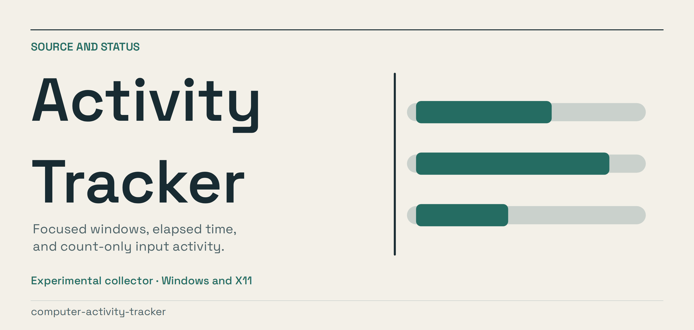
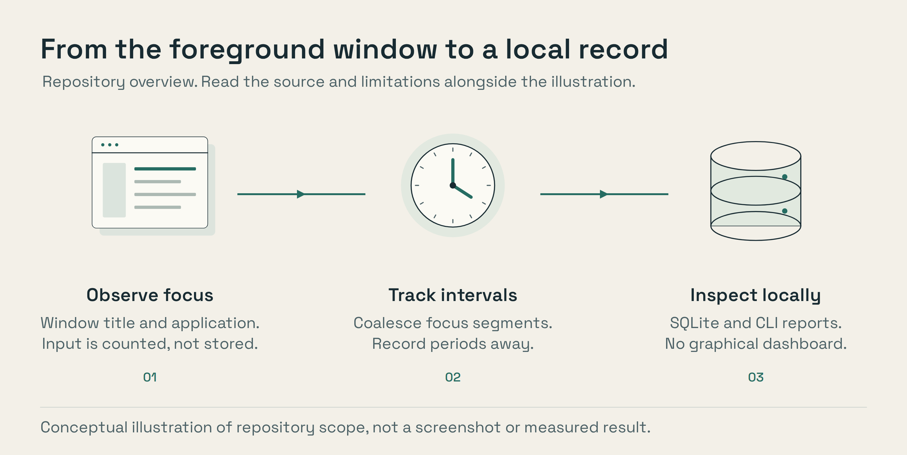

<p align="center"><a href="assets/presentation/banner.png"></a></p>

# Activity Tracker

A background collector for Windows and Linux/X11. It records focused window
titles, application identities, focus duration, aggregate key counts and AFK
intervals in a local SQLite database. It does not include a graphical dashboard.

Raw keystrokes, screenshots and clipboard contents are not stored. Window titles
can still contain sensitive information. Use it on your own machine, review
what it captures, and avoid sharing the raw database.

The X11 recorder was exercised with synthetic windows on an isolated display.
Windows core tests also run on Linux; that is not a fresh Windows installer test.

[](assets/presentation/overview.png)

## Platforms

| Platform | Capture layer | Status |
|---|---|---|
| Windows 10/11 | Win32 foreground window, process path, `GetLastInputInfo`, count-only `pynput` hook | Win32 implementation; see platform guide |
| Linux/X11 | `_NET_ACTIVE_WINDOW`, `WM_CLASS`, raw XI2 input events | Tested on Xvfb with Openbox |
| Wayland | Not implemented | Unsupported |
| macOS | Not implemented | Unsupported |

## Captured data

- Focused window title
- Process or application name
- Focus segment start and end time
- Aggregate key-release count per segment
- AFK intervals

Raw key values are discarded immediately.

## Windows

The Windows implementation lives under [`windows/`](windows/README-WINDOWS.md).

Install from PowerShell:

```powershell
powershell -NoProfile -ExecutionPolicy Bypass -File .\windows\install.ps1
```

The installer:

1. Creates an isolated Python environment
2. Installs `pynput`
3. Runs the deterministic storage self-test
4. Creates `Computer Activity Tracker.lnk` on the Desktop

Double-click the shortcut to run the collector hidden in the logged-in Windows session. A named mutex prevents duplicate instances.

Windows data path:

```text
%LOCALAPPDATA%\ComputerActivityTracker\activity.sqlite3
```

View a report:

```bat
.venv\Scripts\python.exe windows\windows_activity_tracker.py --report
```

Export JSON:

```bat
.venv\Scripts\python.exe windows\windows_activity_tracker.py --json
```

## Linux/X11

Setup:

```bash
python3 -m venv .venv
.venv/bin/pip install -r requirements.txt
```

Record for 60 seconds:

```bash
DISPLAY=:0 .venv/bin/python computer_activity_tracker.py --run 60
```

Run continuously:

```bash
DISPLAY=:0 .venv/bin/python computer_activity_tracker.py --forever
```

Read the timeline and per-app rollup:

```bash
.venv/bin/python computer_activity_tracker.py --report
```

Linux data stays in `data/activity.sqlite3` by default.

### Linux configuration

| Environment variable | Default | Meaning |
|---|---:|---|
| `CCA_HOME` | `./data` | SQLite storage directory |
| `CCA_POLL_SEC` | `2` | Focus polling interval in seconds |
| `CCA_IDLE_TIMEOUT` | `180` | Seconds without input before AFK |
| `DISPLAY` | inherited | X11 display to observe |

## Verification

Cross-platform core and entry tests:

```bash
python3 -m unittest discover -s windows -p 'test_*.py' -v
```

Linux tests:

```bash
.venv/bin/python -m unittest -v test_tracker.py
```

Isolated X11 smoke test:

```bash
Xvfb :100 -screen 0 1024x768x24 -nolisten tcp -ac &
DISPLAY=:100 openbox &
.venv/bin/python smoke_test.py
```

The X11 smoke test requires two distinct focused windows, coalesced segments, application identities, aggregate key counts, AFK transitions, and focus suppression while AFK.

## Architecture

- `computer_activity_tracker.py`: Linux/X11 collector and reporting CLI
- `smoke_test.py`: deterministic live X11 integration test
- `windows/activity_core.py`: platform-independent Windows activity state machine and SQLite store
- `windows/windows_activity_tracker.py`: Win32 capture layer and Windows CLI
- `windows/install.ps1`: Windows dependency installation and self-test
- `windows/create_shortcut.ps1`: hidden Desktop launcher

The Windows core checkpoints open focus segments on every poll, limiting crash loss to one polling interval.

## Privacy and limitations

- Window titles may contain document names or page titles. Treat the database as personal data.
- Browser URLs are captured only when present in the window title.
- The Windows collector must run in the interactive user session. Windows OpenSSH session 0 cannot observe the logged-in desktop.
- The project currently provides CLI reports rather than a graphical UI.

## License

MIT. See [`LICENSE`](LICENSE).

## Illustration sources

The figures explain the repository’s scope; they are not captured product
screens or benchmark results. Editable sources and rendering instructions are
in [scripts/artwork](scripts/artwork/README.md).
